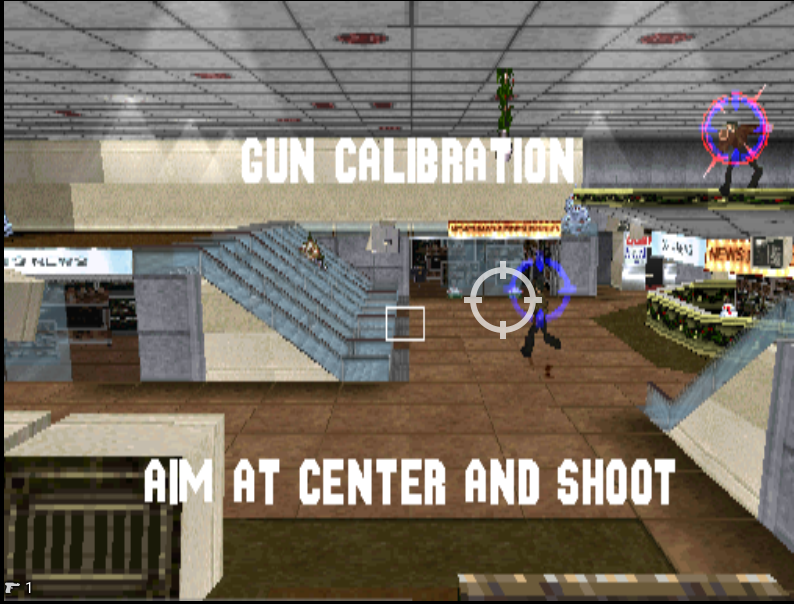

# Die Hard Trilogy PSX DH1 and DH2 fixes

PPF patches for Die Hard Trilogy on PlayStation: **Die Hard 1 Dual Shock
controls**, plus **Die Hard 2** title-screen lightgun calibration and a smaller HUD.

## Die Hard 1 Dual Shock controls

In the trilogy launcher's Controllers menu, select Die Hard 1 and cycle past
layouts A, B and C to **Dual Shock**, then start Die Hard 1. The original layouts
remain available, and analog input works in the launcher and Die Hard 1 menus.

**Analog mode does not activate automatically. You must press the Analog button
on your joypad to enable it.** In an emulator, use an Analog Controller and enable
its analog mode.

| Input | Action |
| --- | --- |
| Left stick / D-pad | Move forward/backward and strafe left/right |
| Right stick left/right | Turn |
| L1 | Throw grenade |
| R1 | Shoot |
| L2 | Change grenade |
| R2 | Jump |
| Square | Roll left |
| Cross (X) | Roll right |
| Triangle / Select | Zoom map |
| Circle | Unassigned |
| Start | Pause |

[Patch instructions and tested base image](patches/Die%20Hard%201%20Dual%20Shock.md).

## Calibration preview



On the **Die Hard 2 title screen**, press and release the gun's **grenade
button**, aim at the **center of the white target box**, and shoot once.
Release the trigger to return to the title screen, then start playing.
**Start cancels calibration.** The grenade button works normally during gameplay.

The calculated offset lasts for the current session. Calibrate again after a
fresh boot; the result is not saved to the memory card. A center shot corrects
an offset, not aiming scale errors near the edges.

## UI preview


The UI patch makes the score and counters smaller, moves the rocket/grenade
counters to the bottom left, corrects the health badge proportions, and removes
the controller-mode symbol.

## Downloads

- [Die Hard 1 Dual Shock.ppf](patches/Die%20Hard%201%20Dual%20Shock.ppf)
  — selectable dual-stick controls and analog support in both menus.
- [Die Hard 2 Calibration Patch.ppf](patches/Die%20Hard%202%20Calibration%20Patch.ppf)
  — press the grenade button on the title screen, then shoot the center target
  to set aiming offsets for your setup. [Instructions](patches/Calibration.md).
- [Die Hard 2 UI Patch.ppf](patches/Die%20Hard%202%20UI%20Patch.ppf) — corrected
  health badge proportions, smaller rocket/grenade counters at bottom left,
  smaller score centered near the top, and no controller-mode icon.

Use calibration and UI together, or either patch on its own. Their application
order does not matter.

**Upgrading from an older release:** calibration replaces the former
**Gun Patch Mister** and **Gun Patch Emulator** downloads. Undo your old fixed
aiming patch first, or start from your original Nuvee GunCon-patched backup.
The UI patch can remain installed. Do not stack calibration with a fixed offset.

## Supported base image for Die Hard 2 patches

**Die Hard Trilogy (USA) (v1.1), SLUS-00119**, with the existing
**Nuvee USA Greatest Hits GunCon conversion already applied**.
https://emulationrealm.net/downloads/plugins/playstation/input/nuvee

Apply to `Die Hard Trilogy (USA) (v1.1) (Track 01).bin`, not the CUE or CHD.
These patches do not install the original GunCon conversion and do not target
an unmodified game image or other regions/revisions.

Expected Track 01 SHA-256:

```text
1a2f348289285ad95cbaed49ffb535cc0d3792307a9a7d6c66fa6c486cdef3a1
```

Make a copy of the supported BIN and apply the chosen PPFs with a
PPF3-compatible patcher. UI and aiming patches can be applied in either order.
Keep the other tracks and CUE together. Boot the game fresh after patching:
old savestates can restore the previous code in RAM. Normal memory-card saves
can still be used. For CHD use, patch the BIN before rebuilding the CHD.

[Full application and undo instructions](patches/README.md).

## Status

The user tested the Die Hard 1 controls and menu/loading behavior successfully
in DuckStation. Its PPF application/undo and sector checks passed, along with
4,862 simulated MIPS cases. Physical hardware and saving the layout selection
to a memory card remain untested.

The calibration and UI changes were tested successfully by the user in
DuckStation. MiSTer/hardware testing remains outstanding. Calibration opens
only from the title screen and does not interrupt gameplay.

All PPFs include undo data and regenerated sector EDC/ECC. The builder checks
application, executable bytes, checksums, undo, and UI/aiming combinations in
both orders. [Verification manifest](patches/Verification.json).

## Rebuilding the Die Hard 2 patches

Python 3.11 or newer, standard library only:

```sh
python tools/build_patches.py "/path/to/Die Hard Trilogy (USA) (v1.1) (Track 01).bin"
```

The builder requires the exact source hash above, opens the source read-only,
and writes generated PPFs and a verification manifest to `build/`. The game
image is supplied locally by the user; it is not included in this repository.

Implementation:

- `tools/badge_renderer.py`: replacement HUD helper within the existing code
  footprint; the health-strip caller uses a 32 × 19 textured quad.
- `tools/hud_layout.py`: counter/score size and position edits.
- `tools/calibration_mips.py`: title-screen calibration, input capture, and session offsets.
- `tools/build_patches.py`: calibration/UI packaging, mode-icon suppression, PPF writer,
  application/undo checks, and combination checks.
- `tools/disc_image.py` and `tools/sector_ecc.py`: raw disc reading and sector
  checksum generation.

## References

This work builds on the existing
[Nuvee GunCon conversion](https://github.com/mirror/nuvee/tree/master/ps1%20-%20guncon%20conversions/Die%20Hard%20Trilogy).
PPF3 encoding follows the original
[MakePPF3 source](https://github.com/Sappharad/MultiPatch/blob/master/ppfdev/makeppf3_linux.c).
